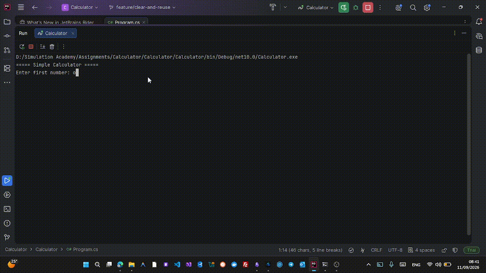

# C# Console Calculator

A simple **C# Console Calculator** built to practice fundamental C# programming concepts, input validation, reusable program flow, and Git feature branching.

The project started as a basic calculator and was gradually improved by adding independent features such as input validation and the ability to reuse the calculator without restarting the application.

---

## 📌 Project Overview

This application allows the user to perform basic arithmetic operations:

* Addition `+`
* Subtraction `-`
* Multiplication `*`
* Division `/`

The application also validates user input and allows multiple calculations during the same session.

---

## ✨ Features

### 1. Basic Calculator

Supports the following arithmetic operations:

| Operation      | Operator | Example       |
| -------------- | -------- | ------------- |
| Addition       | `+`      | `10 + 5 = 15` |
| Subtraction    | `-`      | `10 - 5 = 5`  |
| Multiplication | `*`      | `10 * 5 = 50` |
| Division       | `/`      | `10 / 5 = 2`  |

---

### 2. Input Validation

The application validates user input before performing calculations.

#### Number Validation

If the user enters an invalid number:

```text
Enter first number: abc

Invalid input. Please enter a valid number.
```

The application keeps asking until a valid number is entered.

#### Operator Validation

Only the following operators are accepted:

```text
+
-
*
/
```

For example:

```text
Enter operator: %

Invalid operator. Please use +, -, *, or /.
```

#### Division by Zero

The application prevents division by zero:

```text
Enter first number: 10
Enter operator: /
Enter second number: 0

Error: Cannot divide by zero.
```

The user is then asked to enter another number.

---

### 3. Clear and Reuse

The calculator does not need to be restarted after every calculation.

After displaying the result, the application asks:

```text
Do you want to calculate again? (Y/N):
```

If the user enters:

```text
Y
```

the screen is cleared and a new calculation starts.

If the user enters:

```text
N
```

the application exits.

Example:

```text
===== Simple Calculator =====

Enter first number: 10
Enter operator: +
Enter second number: 20

Result: 30

Do you want to calculate again? (Y/N): Y
```

The calculator can then be used again without restarting the application.

---

## 🛠️ Technologies

* **C#**
* **.NET**
* **Console Application**
* **Git**
* **GitHub**

---

## 📋 Requirements

Before running the project, make sure you have:

* [.NET SDK](https://dotnet.microsoft.com/download)
* Git (optional, if you want to clone and work with the repository)
* A code editor such as Visual Studio or Visual Studio Code

---

## 🚀 How to Run

### 1. Clone the Repository

```bash
git clone <https://github.com/mohamedraslan25/Calculator>
```

### 2. Navigate to the Project

```bash
cd <Calculator>
```

### 3. Run the Application

```bash
dotnet run
```

---

## ▶️ How to Use

When the application starts, you will see:

```text
===== Simple Calculator =====
```

### Step 1 — Enter the First Number

```text
Enter first number: 10
```

### Step 2 — Enter the Operator

```text
Enter operator (+, -, *, /): +
```

### Step 3 — Enter the Second Number

```text
Enter second number: 20
```

### Step 4 — View the Result

```text
Result: 30
```

### Step 5 — Continue or Exit

```text
Do you want to calculate again? (Y/N):
```

Enter `Y` to perform another calculation or `N` to exit.

---

## 🎬 Demo

The following GIF demonstrates how to use the calculator, including:

* Entering numbers
* Selecting an operator
* Getting the result
* Handling invalid input
* Reusing the calculator

> Add your GIF file here:

## 🎬 Demo



---

## 📁 Project Structure

A simple project structure can look like this:

```text
CSharp-Calculator/
│
├── Calculator/
│   ├── Program.cs
│   └── Calculator.csproj
│
├── docs/
│   └── calculator-demo.gif
│
├── README.md
└── .gitignore
```

---

## 🔀 Git Workflow

The project was developed using separate feature branches to keep each feature isolated.

### Main Branches

```text
main
 │
 └── dev
```

* `main` → Stable version of the application
* `dev` → Integration and testing branch

### Feature Branches

```text
dev
 │
 └── feature/basic-calculator
          │
          └── feature/input-validation
                   │
                   └── feature/clear-and-reuse
```

Each feature was developed separately and tested before being integrated into the main development branch.

### Feature Branches

#### Basic Calculator

```text
feature/basic-calculator
```

Contains the initial calculator functionality.

#### Input Validation

```text
feature/input-validation
```

Adds validation for:

* Numbers
* Operators
* Division by zero

#### Clear and Reuse

```text
feature/clear-and-reuse
```

Allows the user to perform multiple calculations without restarting the application.

---

## 🧪 Example

A complete calculation:

```text
===== Simple Calculator =====

Enter first number: 25
Enter operator (+, -, *, /): *
Enter second number: 4

Result: 100

Do you want to calculate again? (Y/N): Y
```

Another calculation can immediately be performed:

```text
===== Simple Calculator =====

Enter first number: 100
Enter operator (+, -, *, /): /
Enter second number: 5

Result: 20

Do you want to calculate again? (Y/N): N

Thank you for using the calculator!
```

---

## 🧠 Concepts Practiced

This project was created as a practical exercise to reinforce several C# concepts:

* Variables
* Data types
* `double`
* `char`
* `string`
* `if` statements
* `switch`
* `while` loops
* Methods
* `TryParse`
* Input validation
* Exception prevention
* String comparison
* Console input/output
* Program flow
* Git branching
* Git commits
* Feature-based development

---

## 🔮 Future Improvements

Possible future features include:

* [ ] Add more mathematical operations
* [ ] Add calculation history
* [ ] Add percentage calculation
* [ ] Add power and square root operations
* [ ] Improve the console UI
* [ ] Add a menu-based interface
* [ ] Separate calculator logic into a dedicated class
* [ ] Add unit tests
* [ ] Improve error handling
* [ ] Add support for continuous calculations

---

## 📄 License

This project is created for learning and practice purposes.

---

## 👨‍💻 Author

**Mohamed Ayman**

C# / .NET Developer in Training

GitHub: [Mohamed Ayman](https://github.com/mohamedraslan25)

LinkedIn: [Mohamed Ayman](https://www.linkedin.com/in/mohamed-ayman-raslan-1ba26220b/)
